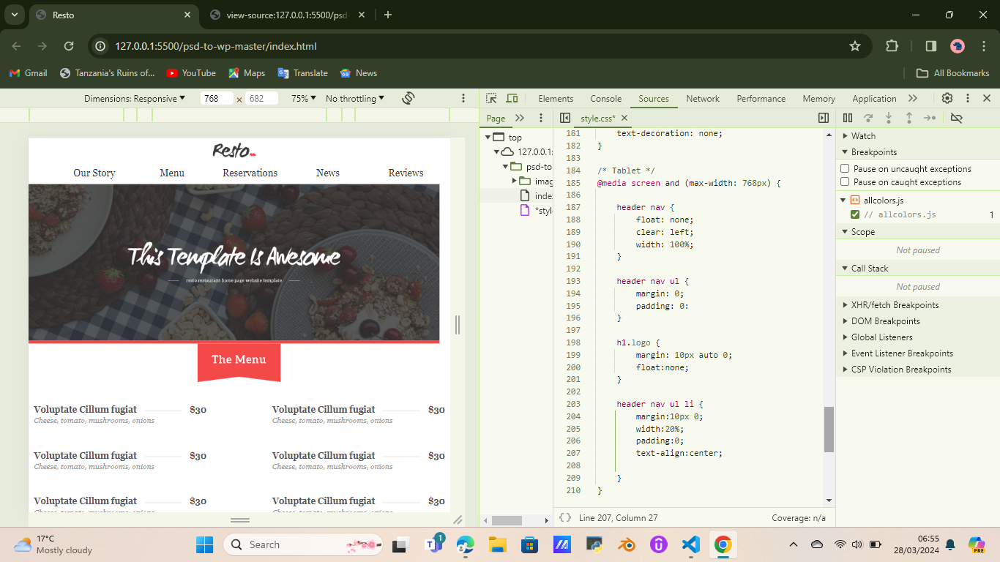

# RESPONSIVE WEB DESIGN (RWD)
-----

* This is a Web design __approach__ that aims to help render web pages well on all the different types of devices.

- In otherwords it is a way to design for multi device web.

--------------------------------------
Below is an example of a templetes that uses media querries to render a page for a tablet screen...


----------------------------------------

# MEDIA QUERIES

- Media queries allow us to run a series of tests, that if the test results to true, the rules defined in it are executed.

* Syntax
``` @media <media-type> and (<expression-to-make-comparison-with>) {} ```

* Example
The media query tests if the device width is that of a mobile ie 480px and changes the background color of the footer to lightblue

```@media screen and (max-width: 480px) {

    footer{
        background-color: lightblue;
    }
}```
